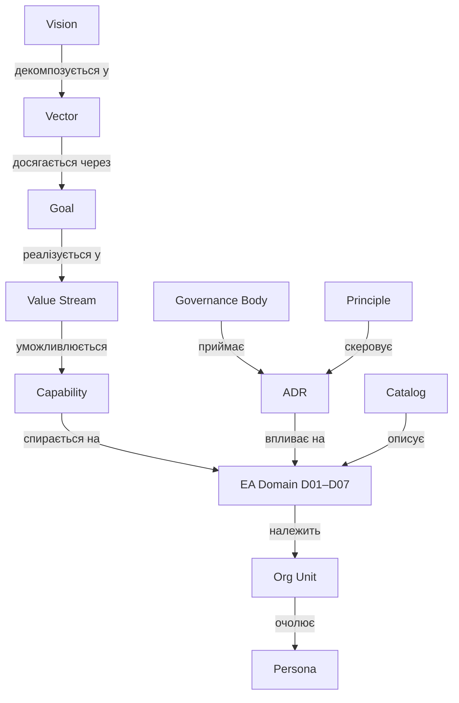

# Semantic Model — метамодель vault

Єдина модель сутностей і зв'язків. Кожна нотатка = один екземпляр сутності. Тип сутності — у frontmatter `type`, зв'язки — wikilinks у frontmatter та тілі.

## Сутності

| Тип (`type`) | Префікс | Папка | Що це |
|---|---|---|---|
| `vision` | — | `10-Strategy` | Візія / точка прибуття |
| `vector` | `VEC-` | `10-Strategy/Vectors` | Стратегічний вектор (напрям руху) |
| `goal` | `GOAL-` | `10-Strategy/Goals` | Вимірювана ціль |
| `value-stream` | `VS-` | `20-Value-Chain` | Потік створення цінності (тригер → результат) |
| `capability` | `CAP-` | `30-Capabilities` | Бізнес-здатність (ЩО вміє компанія, не ЯК) |
| `ea-domain` | `D0x-` | `40-EA-Domains` | Домен авторської 7-доменної моделі EA |
| `governance-body` | — | `50-Governance/Bodies` | Орган прийняття рішень (ARB, ASC, CoP) |
| `principle` | `PRN-` | `50-Governance/Principles` | Архітектурний принцип |
| `adr` | `ADR-` | `50-Governance/ADR` | Architecture Decision Record |
| `catalog` | `CAT-` | `50-Governance/Catalogs` | Каталог / модель — єдине джерело правди |
| `persona` | — | `60-Organization/Personas` | Людина-власник ролі |
| `org-unit` | — | `60-Organization` | Підрозділ (зараз — секції в Org-Structure) |
| `moc` | `_MOC-` | скрізь | Map of Content — навігаційний вузол |

### Розширення: контур змін (portfolio) та люди

Типи, додані до моделі (наповнюються в ході роботи; частина з'явиться при реальному впровадженні):

| Тип (`type`) | Префікс | Домен | Що це |
|---|---|---|---|
| `idea` | `IDEA-` | D02 (зміни) | Ідея — вхід у воронку (пор. AI Ideas Bank ДТЕК) |
| `initiative` | `INI-` | D02 (зміни) | Ініціатива — ідея з бізнес-кейсом, проходить ARB |
| `program` | `PRG-` | D02 (зміни) | Програма — портфель проєктів під вектор (напр. QUANTUM) |
| `project` | `PRJ-` | D02 (зміни) | Проєкт — обмежена в часі зміна; розвиває capability, змінює застосунки |
| `epic` | `EPIC-` | D02 (зміни) | Епік — великий шматок scope проєкту |
| `task` | `TASK-` | D02 (зміни) | Таска — атомарна одиниця роботи; виконується персоною |
| `skill` | `SKILL-` | D07 | Скіл — вимога ролі / компетенція персони |

Зв'язки контуру змін: `Ціль → породжує → Ініціатива → групується в → Програма → декомпозується у → Проєкт → Епік → Таска`; `Проєкт → розвиває → Capability`; `Програма → реалізує → Вектор`; `Персона → обіймає → Роль → вимагає → Скіл`. Ініціатива проходить [[ARB]], рішення фіксується як [[_MOC-ADR|ADR]] під дією [[_MOC-Principles|Принципів]].

## Зв'язки (ребра графа)

| Зв'язок | Від → До | Поле frontmatter |
|---|---|---|
| декомпозується у | Vision → Vector | `vectors:` |
| досягається через | Vector → Goal | `goals:` |
| уможливлюється | Vector / VS → Capability | `enabled_by:` |
| реалізується у | Goal → Value Stream | `realized_in:` |
| спирається на | Capability → EA Domain | `domains:` |
| має власника | будь-що → Persona | `owner:` |
| скеровує | Principle → ADR | `applies_to:` |
| приймається | ADR → Body | `decided_by:` |
| описує | Catalog → Domain | `describes:` |

## Правило читання графа

> **Цінність тече зліва направо, підзвітність — знизу вгору.**
> Кожна capability відповідає на питання "яку ціль і який value stream я живлю?" (лінк угору) та "на які домени я спираюсь і хто власник?" (лінк униз).

## Приклад повного ланцюга

[[Vision-2026]] → [[VEC-01-AI-First]] → [[GOAL-02-QUANTUM-15-AI]] → [[VS-02-Deliver-Solutions]] → [[CAP-05-AI-Engineering]] → [[D03-Data-AI]] → власник [[Vyntu-V]], рішення через [[ARB]], зафіксовано в [[ADR-0001-AI-Governance-Checklist]].
