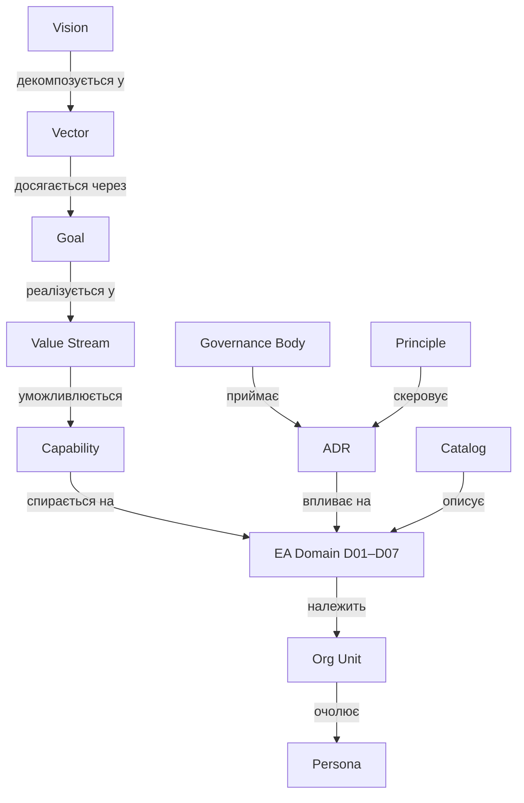

# Semantic Model — метамодель vault

Єдина модель сутностей і зв'язків. Кожна нотатка = один екземпляр сутності. Тип сутності — у frontmatter `type`, зв'язки — wikilinks у frontmatter та тілі.

## Сутності

| Тип (`type`) | Префікс | Папка | Що це |
|---|---|---|---|
| `vision` | — | `10-Strategy` | Візія / точка прибуття |
| `vector` | `VEC-` | `10-Strategy/Vectors` | Стратегічний вектор (напрям руху) |
| `goal` | `GOAL-` | `10-Strategy/Goals` | Вимірювана ціль |
| `value-stream` | `VS-` | `20-Value-Chain` | Потік створення цінності (тригер → результат) |
| `capability` | `CAP-` | `30-Capabilities` | Бізнес-здатність (ЩО вміє компанія, не ЯК) |
| `ea-domain` | `D0x-` | `40-EA-Domains` | Домен авторської 7-доменної моделі EA |
| `governance-body` | — | `50-Governance/Bodies` | Орган прийняття рішень (ARB, ASC, CoP) |
| `principle` | `PRN-` | `50-Governance/Principles` | Архітектурний принцип |
| `adr` | `ADR-` | `50-Governance/ADR` | Architecture Decision Record |
| `catalog` | `CAT-` | `50-Governance/Catalogs` | Каталог / модель — єдине джерело правди |
| `persona` | — | `60-Organization/Personas` | Людина-власник ролі |
| `org-unit` | — | `60-Organization` | Підрозділ (зараз — секції в Org-Structure) |
| `moc` | `_MOC-` | скрізь | Map of Content — навігаційний вузол |

### Розширення: контур змін (portfolio) та люди

Типи, додані до моделі (наповнюються в ході роботи; частина з'явиться при реальному впровадженні):

| Тип (`type`) | Префікс | Домен | Що це |
|---|---|---|---|
| `idea` | `IDEA-` | D02 (зміни) | Ідея — сирий сигнал попиту, без власника і оцінки (пор. AI Ideas Bank ДТЕК, 180+) |
| `business-case` | `BC-` | D02 (зміни) | Бізнес-кейс — те, що перетворює ідею на ініціативу: проблема, власник, оцінка цінності |
| `benefit` | `BEN-` | D02 (зміни) | Бенефіт — очікувана цінність із власником і датою заміру; замикає цикл назад на ціль |
| `initiative` | `INI-` | D02 (зміни) | Ініціатива — оформлений попит із бізнес-власником; проходить ARB |
| `program` | `PRG-` | D02 (зміни) | Програма — портфель проєктів під вектор (напр. QUANTUM) |
| `project` | `PRJ-` | D02 (зміни) | Проєкт — обмежена в часі зміна; розвиває capability, змінює застосунки |
| `epic` | `EPIC-` | D02 (зміни) | Епік — великий шматок scope проєкту |
| `task` | `TASK-` | D02 (зміни) | Таска — атомарна одиниця роботи; виконується персоною |
| `okr` | `OKR-` | D01 (вимірювання) | Квартальний Objective + Key Results — амбіція в часі; має власника (роль) і походить від цілі |
| `kpi` | `KPI-` | наскрізний | Метрика здоров'я сутності — процесу, сервісу, capability, застосунку, платформи |
| `contract` | `CTR-` | D02 (run) | Договір — комерційна угода з клієнтом; покриває сервіси, містить СЛА |
| `sla` | `SLA-` | D02 (run) | Рівень обслуговування — задає порогові значення KPI для сервісу |
| `position` | `POS-` | D07 | Посада — штатна одиниця в оргструктурі (не людина і не роль) |
| `skill` | `SKILL-` | D07 | Скіл — вимога посади/ролі, компетенція персони |

Зв'язки контуру змін: `Ціль → породжує → Ідея → оформлюється в → Бізнес-кейс → кваліфікує → Ініціатива → групується в → Програма → декомпозується у → Проєкт → Епік → Таска`; `Проєкт → розвиває → Capability`; `Програма → реалізує → Вектор`; `Бізнес-кейс → декларує → Бенефіт → підтверджує → Ціль`.

### Два контури: правила згори, свідчення знизу

Governance і вимірювання — **не рівні ієрархії, а контури** навколо неї. Принцип не стоїть над візією: він з неї *випливає* (`Візія → Принцип → ADR`), тому в моделі має поле `applies_to`, а не `parent`. Так само KPI не «під» технологіями — він міряє сутність будь-якого поверху.

| Контур | Об'єкти | Питання |
|---|---|---|
| **Згори — правила** | Принцип → [[_MOC-ADR\|ADR]] | «як вирішуємо» |
| **Знизу — свідчення** | OKR → KPI | «як знаємо, що спрацювало» |

**OKR ≠ KPI:**

| | **OKR** | **KPI** |
|---|---|---|
| Природа | амбіція, зміна | здоров'я, стан |
| Горизонт | квартал, є дедлайн | безперервно, є поріг |
| Прив'язка | до `Ціль` (D01) | до `Процес` · `Сервіс` · `Capability` · `Застосунок` · `Платформа` |
| Питання | «що зрушуємо цього кварталу» | «як воно працює зараз» |

Зв'язок між ними: **Key Result = зрушити конкретний KPI з A до B**. Саме тому KR без прив'язаного KPI — це побажання, а KPI без OKR — просто термометр.

**Хто що має** (типова помилка — підвісити OKR/KPI в порожнечу):

| Об'єкт | Обов'язкові зв'язки |
|---|---|
| `OKR` | ← **власник**: `Роль` (або оргюніт) · → **походить від**: `Ціль` · → **рухає**: `KPI` |
| `KPI` | ← **належить сутності**, яку міряє: `Процес` · `Capability` · `Сервіс` · `Застосунок` · `Платформа` · → **підтверджує**: `Бенефіт` · ← **пороги задає**: `СЛА` |
| `Договір` | → покриває `Сервіс` · → містить `СЛА` |
| `СЛА` | → визначає порогові `KPI` для `Сервіс` |

Ланцюг, який робить value realization робочим: `Бізнес-кейс → декларує → Бенефіт → вимірюється через → KPI → підтверджує → Ціль`. Без ребра `Бенефіт → KPI` цінність лишається деклараційною.

Комерційний ланцюг: `Договір → покриває → Сервіс → має → СЛА → задає пороги → KPI`. Для MODUS X це критично: Managed Services і SOC-aaS — recurring-ядро, де SLA і є предметом продажу.

Приклади для MODUS X: KPI — `ARB coverage %`, `Governance NPS`, `lead time контракт→прод`, `SLA compliance`, `техборг портфеля`. OKR Q1 — «Запустити архітектурне врядування»: KR1 ARB coverage 0 → 100% значущих ініціатив, KR2 6–8 принципів затверджено CEO, KR3 AI Gov Checklist на 5+ проєктах QUANTUM.

### BRM — шар між бізнесом і IT

**Ідея ≠ Ініціатива.** Ідея — сирий сигнал попиту (нульова ціна помилки, хай живе тисяча). Ініціатива — оформлений попит із власником і бізнес-кейсом (уже їсть ресурс). Перехід між ними — це робота, а не адміністративна процедура: хтось має уточнити проблему, знайти власника, оцінити цінність, звʼязати з ціллю. Це **demand shaping** з BRM.

Два різні гейти, які часто плутають:

| Гейт | Питання | Хто веде |
|---|---|---|
| **BRM** | «чи варто» — чи є цінність і власник | BRM / бізнес-партнер |
| **[[ARB]]** | «чи правильно» — чи архітектурно узгоджено | Architecture Review Board |

ARB без BRM = архітектурна поліція, що ревʼює погано сформульовані ідеї. BRM без ARB = чудові стосунки і безладний ландшафт.

**Value realization** — друга частина BRM, яку зазвичай не має ніхто: після go-live хтось відповідає, чи настав задекларований `Бенефіт`. Саме тому в моделі є зворотне ребро `Бенефіт → підтверджує → Ціль` — граф перестає бути деревом і стає замкненим циклом.

У MODUS X BRM існує де-факто: **AI-координатори** в підрозділах ведуть воронку Quantum, а **NPS внутрішніх клієнтів (+40% за рік)** — канонічна BRM-метрика. Ролі governance у [[D07-People-Culture]]: Domain Owner · ARB Chair · **BRM**.

Кадрова вертикаль (D07): `Оргюніт → містить → Посада → обіймається → Персона → несе → Роль → вимагає → Скіл`. **Посада ≠ Роль**: посада — штатна одиниця оргструктури (бюджет, звітність), роль — функція в процесі чи RACI. Одна персона на одній посаді може нести кілька ролей (напр. Head of PMO + Chair of ARB), і саме роль, а не посада, лінкується до процесів і доменів. Ініціатива проходить [[ARB]], рішення фіксується як [[_MOC-ADR|ADR]] під дією [[_MOC-Principles|Принципів]].

## Зв'язки (ребра графа)

| Зв'язок | Від → До | Поле frontmatter |
|---|---|---|
| декомпозується у | Vision → Vector | `vectors:` |
| досягається через | Vector → Goal | `goals:` |
| уможливлюється | Vector / VS → Capability | `enabled_by:` |
| реалізується у | Goal → Value Stream | `realized_in:` |
| спирається на | Capability → EA Domain | `domains:` |
| має власника | будь-що → Persona | `owner:` |
| скеровує | Principle → ADR | `applies_to:` |
| приймається | ADR → Body | `decided_by:` |
| описує | Catalog → Domain | `describes:` |

## Правило читання графа

> **Цінність тече зліва направо, підзвітність — знизу вгору.**
> Кожна capability відповідає на питання "яку ціль і який value stream я живлю?" (лінк угору) та "на які домени я спираюсь і хто власник?" (лінк униз).

## Приклад повного ланцюга

[[Vision-2026]] → [[VEC-01-AI-First]] → [[GOAL-02-QUANTUM-15-AI]] → [[VS-02-Deliver-Solutions]] → [[CAP-05-AI-Engineering]] → [[D03-Data-AI]] → власник [[Vyntu-V]], рішення через [[ARB]], зафіксовано в [[ADR-0001-AI-Governance-Checklist]].
