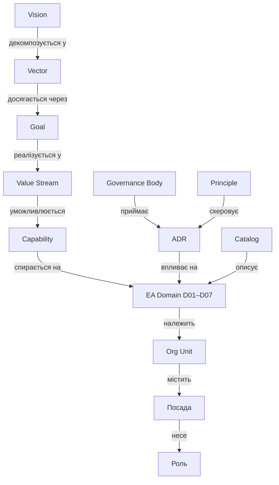

# Semantic Model — метамодель vault

Єдина модель сутностей і зв'язків. Кожна нотатка = один екземпляр сутності. Тип сутності — у frontmatter `type`, зв'язки — wikilinks у frontmatter та тілі.

## Сутності

| Тип (`type`) | Префікс | Папка | Що це |
|---|---|---|---|
| `vision` | — | `10-Strategy` | Візія / точка прибуття |
| `vector` | `VEC-` | `10-Strategy/Vectors` | Стратегічний вектор (напрям руху) |
| `goal` | `GOAL-` | `10-Strategy/Goals` | Вимірювана ціль |
| `value-stream` | `VS-` | `20-Value-Chain` | Потік створення цінності (тригер → результат) |
| `capability` | `CAP-` | `30-Capabilities` | Бізнес-здатність (ЩО вміє компанія, не ЯК) |
| `ea-domain` | `D0x-` | `40-EA-Domains` | Домен авторської 7-доменної моделі EA |
| `governance-body` | — | `50-Governance/Bodies` | Орган прийняття рішень (ARB, QBR) |
| `principle` | `AP-` | `50-Governance/Principles` | Архітектурний принцип |
| `adr` | `ADR-` | `50-Governance/ADR` | Architecture Decision Record |
| `catalog` | `CAT-` | `50-Governance/Catalogs` | Каталог / модель — єдине джерело правди |
| `role` | `ROLE-` | `60-Organization/Roles` | **Роль** — функція в процесі; власник сутностей у моделі |
| `persona` | — | — | Людина, що обіймає посаду. Канонічний тип (TOGAF *Actor*), **свідомо без екземплярів** — див. нижче |
| `org-unit` | — | `60-Organization` | Підрозділ (зараз — секції в Org-Structure) |
| `moc` | `_MOC-` | скрізь | Map of Content — навігаційний вузол |

### Розширення: контур змін (portfolio) та люди

Типи, додані до моделі (наповнюються в ході роботи; частина з'явиться при реальному впровадженні):

| Тип (`type`) | Префікс | Домен | Що це |
|---|---|---|---|
| `idea` | `IDEA-` | D02 (зміни) | Ідея — сирий сигнал попиту, без власника і оцінки (пор. AI Ideas Bank ДТЕК, 180+) |
| `business-case` | `BC-` | D02 (зміни) | Бізнес-кейс — те, що перетворює ідею на ініціативу: проблема, власник, оцінка цінності |
| `benefit` | `BEN-` | D02 (зміни) | Бенефіт — очікувана цінність із власником і датою заміру; замикає цикл назад на ціль |
| `initiative` | `INI-` | D02 (зміни) | Ініціатива — оформлений попит із бізнес-власником; проходить ARB |
| `program` | `PRG-` | D02 (зміни) | Програма — портфель проєктів під вектор (напр. QUANTUM) |
| `project` | `PRJ-` | D02 (зміни) | Проєкт — обмежена в часі зміна; розвиває capability, змінює застосунки |
| `epic` | `EPIC-` | D02 (зміни) | Епік — великий шматок scope проєкту |
| `task` | `TASK-` | D02 (зміни) | Таска — атомарна одиниця роботи; виконується персоною |
| `okr` | `OKR-` | D01 (вимірювання) | Квартальний Objective + Key Results — амбіція в часі; власник — оргюніт (команда), походить від цілі |
| `kpi` | `KPI-` | наскрізний | Метрика здоров'я сутності — процесу, сервісу, capability, застосунку, платформи |
| `driver` | `DRV-` | D01 | Драйвер — зовнішній чинник, що спричиняє ціль (регуляція, ринок, конкуренція) |
| `client` | `CLI-` | D02 (run) | Клієнт / стейкхолдер — контрагент договору, джерело попиту |
| `product` | `PRD-` | D02 (run) | Продукт — те, що продаємо з власною економікою і roadmap (DEEP), на відміну від сервісу |
| `portfolio` | `PORT-` | D02 (зміни) | Портфель — місце рішення «інвестувати / ні» між ціллю і програмою |
| `change` | `CHG-` | D02 (run) | Зміна (RFC) — операційна зміна в проді; **не те саме, що проєкт** |
| `incident` | `INC-` | D02 (run) | Інцидент — переривання сервісу; породжує зміну |
| `ci` | `CI-` | D05 | Конфігураційна одиниця — екземпляр в експлуатації (CMDB), на відміну від архітектурного типу |
| `contract` | `CTR-` | D02 (run) | Договір — комерційна угода з клієнтом; покриває сервіси, містить СЛА |
| `sla` | `SLA-` | D02 (run) | Рівень обслуговування — задає порогові значення KPI для сервісу |
| `position` | `POS-` | D07 | Посада — штатна одиниця в оргструктурі (не людина і не роль) |
| `skill` | `SKILL-` | D07 | Скіл — вимога посади/ролі, компетенція персони |

Зв'язки контуру змін: `Ціль → породжує → Ідея → оформлюється в → Бізнес-кейс → кваліфікує → Ініціатива → групується в → Програма → декомпозується у → Проєкт → Епік → Таска`; `Проєкт → розвиває → Capability`; `Програма → реалізує → Вектор`; `Бізнес-кейс → декларує → Бенефіт → підтверджує → Ціль`.

### Два контури: правила згори, свідчення знизу

Governance і вимірювання — **не рівні ієрархії, а контури** навколо неї. Принцип не стоїть над візією: він з неї *випливає* (`Візія → Принцип → ADR`), тому в моделі має поле `applies_to`, а не `parent`. Так само KPI не «під» технологіями — він міряє сутність будь-якого поверху.

| Контур | Об'єкти | Питання |
|---|---|---|
| **Згори — правила** | Принцип → [[_MOC-ADR\|ADR]] | «як вирішуємо» |
| **Знизу — свідчення** | OKR → KPI | «як знаємо, що спрацювало» |

**OKR ≠ KPI:**

| | **OKR** | **KPI** |
|---|---|---|
| Природа | амбіція, зміна | здоров'я, стан |
| Горизонт | квартал, є дедлайн | безперервно, є поріг |
| Прив'язка | до `Ціль` (D01), власник — `Оргюніт` | до `Процес` · `Сервіс` · `Capability` · `Застосунок` · `Платформа` |
| Хто НЕ власник | ❌ `Роль` — роль має відповідальності (RACI), а не квартальні амбіції · ❌ `Персона` — при ротації OKR осиротіє | ❌ сама по собі: KPI без сутності, яку міряє, не існує |
| Питання | «що зрушуємо цього кварталу» | «як воно працює зараз» |

Зв'язок між ними: **Key Result = зрушити конкретний KPI з A до B**. Саме тому KR без прив'язаного KPI — це побажання, а KPI без OKR — просто термометр.

**Хто що має** (типова помилка — підвісити OKR/KPI в порожнечу):

| Об'єкт | Обов'язкові зв'язки |
|---|---|
| `OKR` | ← **власник**: `Оргюніт` (командний рівень); індивідуальні OKR — на `Посада`, **не** на `Персона` · → **походить від**: `Ціль` · → **рухає**: `KPI` |
| `KPI` | ← **належить сутності**, яку міряє: `Процес` · `Capability` · `Сервіс` · `Застосунок` · `Платформа` · → **підтверджує**: `Бенефіт` · ← **пороги задає**: `СЛА` |
| `Договір` | → покриває `Сервіс` · → містить `СЛА` |
| `СЛА` | → визначає порогові `KPI` для `Сервіс` |

Ланцюг, який робить value realization робочим: `Бізнес-кейс → декларує → Бенефіт → вимірюється через → KPI → підтверджує → Ціль`. Без ребра `Бенефіт → KPI` цінність лишається деклараційною.

Комерційний ланцюг: `Договір → покриває → Сервіс → має → СЛА → задає пороги → KPI`. Для MODUS X це критично: Managed Services і SOC-aaS — recurring-ядро, де SLA і є предметом продажу.

Приклади для MODUS X: KPI — `ARB coverage %`, `Governance NPS`, `lead time контракт→прод`, `SLA compliance`, `техборг портфеля`. OKR Q1 — «Запустити архітектурне врядування»: KR1 ARB coverage 0 → 100% значущих ініціатив, KR2 6–8 принципів затверджено CEO, KR3 AI Gov Checklist на 5+ проєктах QUANTUM.

### BRM — шар між бізнесом і IT

**Ідея ≠ Ініціатива.** Ідея — сирий сигнал попиту (нульова ціна помилки, хай живе тисяча). Ініціатива — оформлений попит із власником і бізнес-кейсом (уже їсть ресурс). Перехід між ними — це робота, а не адміністративна процедура: хтось має уточнити проблему, знайти власника, оцінити цінність, звʼязати з ціллю. Це **demand shaping** з BRM.

Два різні гейти, які часто плутають:

| Гейт | Питання | Хто веде |
|---|---|---|
| **BRM** | «чи варто» — чи є цінність і власник | BRM / бізнес-партнер |
| **[[ARB]]** | «чи правильно» — чи архітектурно узгоджено | Architecture Review Board |

ARB без BRM = архітектурна поліція, що ревʼює погано сформульовані ідеї. BRM без ARB = чудові стосунки і безладний ландшафт.

**Value realization** — друга частина BRM, яку зазвичай не має ніхто: після go-live хтось відповідає, чи настав задекларований `Бенефіт`. Саме тому в моделі є зворотне ребро `Бенефіт → підтверджує → Ціль` — граф перестає бути деревом і стає замкненим циклом.

У MODUS X BRM існує де-факто: **AI-координатори** в підрозділах ведуть воронку Quantum, а **NPS внутрішніх клієнтів (+40% за рік)** — канонічна BRM-метрика. Ролі governance у [[D07-People-Culture]]: Domain Owner · ARB Chair · **BRM**.

Кадрова вертикаль (D07): `Оргюніт → містить → Посада → обіймається → Персона → несе → Роль → вимагає → Скіл`. **Посада ≠ Роль**: посада — штатна одиниця оргструктури (бюджет, звітність), роль — функція в процесі чи RACI. Одна персона на одній посаді може нести кілька ролей (напр. Head of PMO + Chair of ARB), і саме роль, а не посада, лінкується до процесів і доменів. Ініціатива проходить [[ARB]], рішення фіксується як [[_MOC-ADR|ADR]] під дією [[_MOC-Principles|Принципів]].

## Чому власник — роль, а не людина

У vault **немає персональних даних**. Поле `owner:` веде на `ROLE-`, не на людину. Три причини, і лише одна з них про приватність:

1. **Модель має пережити ротацію.** Governance, у якому власність прив'язана до прізвища, розсипається на першій же кадровій зміні.
2. **Посада ≠ Роль ≠ Персона.** Посада — штатна одиниця (бюджет, звітність). Роль — функція в процесі й RACI. Персона — той, хто зараз обіймає посаду. До процесів, доменів і артефактів лінкується **роль**.
3. **Публічний репозиторій.** Прізвища співробітників компанії тут не потрібні для демонстрації моделі.

Тип `persona` лишається в метамоделі як канонічний (TOGAF *Actor*) — без екземплярів. У реальному впровадженні він наповнюється всередині контуру компанії, у [[CAT-04-Persona-Catalog]].

## Теги — три осі розрізу

Кожна нотатка маркується незалежно за трьома осями, тому один набір нотаток читається кількома способами:

| Вісь | Приклад | Питання |
|---|---|---|
| `modus/type/<тип>` | `modus/type/capability` | що це за сутність |
| `modus/d01` … `modus/d07` | `modus/d03` | до якого домену належить (може бути кілька) |
| `modus/contour/govern` | принципи, ADR, органи | контур правил навколо доменів |

Це і є механізм візуального розмежування доменів у графі Obsidian — 7 кольорових груп за `tag:#modus/d0X`. Налаштування — у [[Conventions]].

## Зв'язки (ребра графа)

| Зв'язок | Від → До | Поле frontmatter |
|---|---|---|
| декомпозується у | Vision → Vector | `vectors:` |
| досягається через | Vector → Goal | `goals:` |
| уможливлюється | Vector / VS → Capability | `enabled_by:` |
| реалізується у | Goal → Value Stream | `realized_in:` |
| спирається на | Capability → EA Domain | `domains:` |
| має власника | будь-що → **Роль** | `owner:` |
| володіє доменом | Роль → EA Domain | `owns_domains:` |
| скеровує | Principle → ADR | `applies_to:` |
| приймається | ADR → Body | `decided_by:` |
| описує | Catalog → Domain | `describes:` |

## Правило читання графа

> **Цінність тече зліва направо, підзвітність — знизу вгору.**
> Кожна capability відповідає на питання "яку ціль і який value stream я живлю?" (лінк угору) та "на які домени я спираюсь і хто власник?" (лінк униз).

## Приклад повного ланцюга

[[Vision-2026]] → [[VEC-01-AI-First]] → [[GOAL-02-QUANTUM-15-AI]] → [[VS-02-Deliver-Solutions]] → [[CAP-05-AI-Engineering]] → [[D03-Data-AI]] → власник [[ROLE-03-CDO]], рішення через [[ARB]], зафіксовано в [[ADR-0001-AI-Governance-Checklist]].

## Звірка з канонічними метамоделями

Кожна сутність промаркована стандартом, з якого походить. Покриття: **TOGAF 28 · COBIT 23 · BIZBOK 19 · ITIL 11 · PMBOK 8 · BRM 6** об'єктів.

| Стандарт | Що звідти взято |
|---|---|
| **TOGAF** | Принцип, ADR, ARB (Architecture Board), Драйвер, Візія, Вектор, Ціль, Процес, Capability, Value Stream, Сервіс, Договір (Contract), СЛА (Service Quality), Застосунок, API, Інтеграція, Датасет, Семантика, Платформа, Стандарт, Оргюніт, Персона (Actor), Роль, Скіл, Вимога, Ризик, KPI (Measure) |
| **BIZBOK** | Capability, Value Stream, Продукт, Клієнт (Stakeholder), Семантика (Information Map), Ініціатива, Портфель, Оргюніт, Політика |
| **ITIL 4** | Сервіс, Продукт, СЛА, Договір, Клієнт, **Зміна (RFC)**, **Інцидент**, **CI (CMDB)**, Процес (practice), Value Stream, KPI |
| **COBIT 2019** | ARB (org structure), Портфель (APO05), Політика, Контроль, Ризик (EDM03), Вимога, Ціль (goals cascade), KPI (metrics), Скіл (people/competencies), Зміна (BAI06) |
| **BRM** | Ідея (demand), Бізнес-кейс, Бенефіт (value realization), Ініціатива, Портфель, **Клієнт (Business Partner)** |
| **PMBOK / PMI** | **Портфель** (*Standard for Portfolio Mgmt*), **Програма** (*Standard for Program Mgmt*), **Проєкт**, Епік, Таска (=Activity у WBS), Бізнес-кейс (project document), **Бенефіт** (*Benefits Realization Management*), Ризик |

### 3 об'єкти поза каноном — свідомі додатки

| Об'єкт | Чому немає в канонах | Навіщо нам |
|---|---|---|
| **Посада** | TOGAF має лише Actor/Role і плутає штатну одиницю з функцією | Кадрові зміни не ламають модель: змінюється персона на посаді, ролі перепризначаються |
| **ML-модель** | Класичні метамоделі створені до AI-ери | **Головна прогалина канону** — і саме її закриває AI governance для QUANTUM |
| **OKR** | Окрема практика (Intel → Google), не входить у жоден із шести | Квартальний ритм між стратегією і виконанням |

> Те, що **ML-модель не підсвічується жодним стандартом** — не недогляд моделі, а діагноз галузі: канони не встигли за AI. Це прямий аргумент, чому AI Governance потрібно будувати окремо ([[ADR-0001-AI-Governance-Checklist]]).

### Свідомо не додано

`Локація` (TOGAF — актуально для GDPR/NIS2), `Gap` (TOGAF), `Реліз` (ITIL), `Аудит` (COBIT), розділення `Goal`/`Objective` (у нас Ціль + OKR). Причина: модель має лишатися робочою, а не повною. Додаються за потреби конкретного домену.
