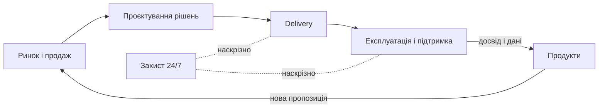

# 🔗 Value Chain — MOC

Ланцюжок створення цінності MODUS X: п'ять наскрізних потоків від тригера до цінності для клієнта. Кожен етап потоку уможливлюється [[_MOC-Capability-Map|capability]].

## Макро-ланцюг



## Value Streams

| ID | Потік | Тригер → Результат |
|---|---|---|
| [[VS-01-Win-Business]] | Win Business | Лід → підписаний контракт |
| [[VS-02-Deliver-Solutions]] | Deliver Solutions | Контракт → рішення в проді |
| [[VS-03-Operate-Support]] | Operate & Support | Інцидент/запит → стабільний сервіс |
| [[VS-04-Develop-Products]] | Develop Products | Ідея → продукт на ринку |
| [[VS-05-Protect-24x7]] | Protect 24/7 | Загроза → нейтралізовано (SOC) |

## Логіка шару

> Value stream відповідає "ЯК тече цінність", capability — "ЩО ми вміємо". Потоки перетинають підрозділи — тому вузькі місця найчастіше на стиках, і саме там працює governance.

```dataview
TABLE trigger, outcome FROM "20-Value-Chain" WHERE type = "value-stream" SORT id
```
